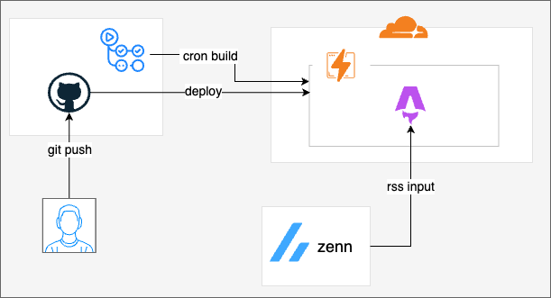

## 🔰 はじめに

**新機能としてブログページを作成しました！**

今後自分が作ったプロジェクトについてはこのページで紹介していきます。

普段はzennで投稿すると思いますがzennよりはできる限り、情報量多めに作ろうと思います。
(zennと被ってる部分は多くあると思いますが目を瞑ってくださいmm)

記念すべき第一弾としてポートフォリオサイトについて紹介したいと思います！！

## ポートフォリオサイトについて

自分の開発記録やアウトプットをまとめる**ポートフォリオサイト**を作成しました。

<https://sa2shidev.com>

サイトの構成や使用した技術、こだわったポイント、デプロイ自動化の工夫などについてまとめます。

---

## サイト構成

- Home
  - 自己紹介
  - スキルスタック
- Blog
  - 個人ブログ
    - 個人で開発したプロダクトや取り組みを紹介
    - 技術以外のこととかも書くかもです
- Articles
  - Zennに投稿した記事一覧の自動反映

## 技術スタック

このポートフォリオサイトは以下の技術スタックで構築しています。

- **フロントエンド**: [Astro](https://astro.build/)
- **CI/CD**: GitHub Actions
- **ホスティング**: Cloudflare Pages
- **記事取得**: Zenn RSS フィード連携

### アーキテクチャ



### Astro

コンテンツ中心のWebサイトに最適なフレームワークとして採用しました。  
ビルド時に静的HTMLを生成してくれるため、**パフォーマンスとSEOに強い**のが魅力です。

<https://astro.build/>

### GitHub Actions

- **master → production**の自動PR作成
- 定期的なZenn記事の取得と再ビルド

CI/CDで完全自動化できたことで、日々の運用コストを大きく下げることができました。

### Cloudflare Pages

高速・無料・GitHub連携がスムーズで、**個人開発に非常に相性が良い**です。  
独自ドメインにも対応しているので、今後の拡張性も考慮して採用しました。

---

## 工夫したポイント

### PRの自動作成

master にマージされた際に production ブランチへのPRを自動で作成するようにしています。
Zennの記事更新などの自動反映も production ブランチで行うようにし、デプロイの安全性と明確なワークフローを意識しました。

以下を参考

<https://zenn.dev/y_satoshi/articles/article-20250526-1>

### Zenn記事を自動取得

「静的サイトにしたいけど、これだとZennの記事が反映されないな…うーん、どうしよう。あ、そうか。定期的にbuildさせればいいんじゃない？」

という考えからZenn の RSS フィードを使って、記事一覧を毎週2回自動更新しています。  
GitHub Actions の `cron` 機能で、**月曜・木曜の朝10時（JST）** に実行されるように設定しました。

```yaml
  # 定期実行（毎週月曜・木曜の10:00 JST = 1:00 UTC）
  schedule:
    - cron: '0 1 * * 1'  # 月曜日 1:00 UTC (10:00 JST)
    - cron: '0 1 * * 4'  # 木曜日 1:00 UTC (10:00 JST)
```

<br>

buildにはcloudflareのwebhookを使っています。

<https://developers.cloudflare.com/pages/configuration/deploy-hooks/>

---

## デザインについて

実は最初に自分でポートフォリオを一通り作成しましたが、**デザインに納得がいかず一からやり直すことを決意**しました。

(ほんとデザインのセンス無くて....AIにとても助かっております)

### bolt.new でページ構成を見直し

その際に活用したのが ***bolt.new***。  
「Astro を使用したポートフォリオサイトの構成案」を自然言語で入力するだけで、**直感的で洗練されたUI設計案**が自動生成されるサービスです。

<https://bolt.new>

<br>

以下の内容を英語で`bolt.new`に入力しました。

```text
    例：
    Astroで以下の機能を含めたポートフォリオサイトを作ってほしい。
    ページ構成と内容は以下の通りです。

    pages
    - Home
    - Blog
    - Articles

    Blogにはmdで動的ページを作るようにしてほしい。
    Articlesには外部記事サービスのzennの記事がカード形式で反映されるようにしてほしい。

    デザインは白黒をベースに差し色を水色でモダンな感じでお願いします。
```

<br>

**bolt.new**のアウトプットを元々作成していたソースに反映し以下のように改善しました。

デザインのセンスがあまり無く、「こういうページにしたいけどどうすればいいのかわからない」
という自分には**bolt.new**はとても良かったです！

---

## これからやりたいこと

1. ダークモード機能の追加
2. wranglerを使った自動デプロイ
   1. wranglerがうまくいかずwebhookにしたのでwranglerに切り替えたい！
3. サイトパフォーマンスの向上
   1. 画像最適化とかキャッシュとか上手く活用したい

## 最後に

今回、ポートフォリオをゼロから作ることで、モダンなフロントエンドやCI/CDの知識を実践的に身につけることができました。
この記事が、これからポートフォリオを作る方の参考になれば幸いです！
